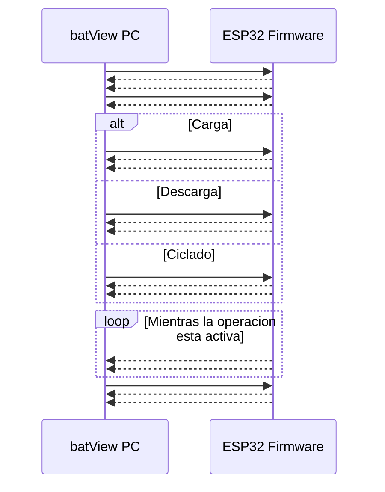
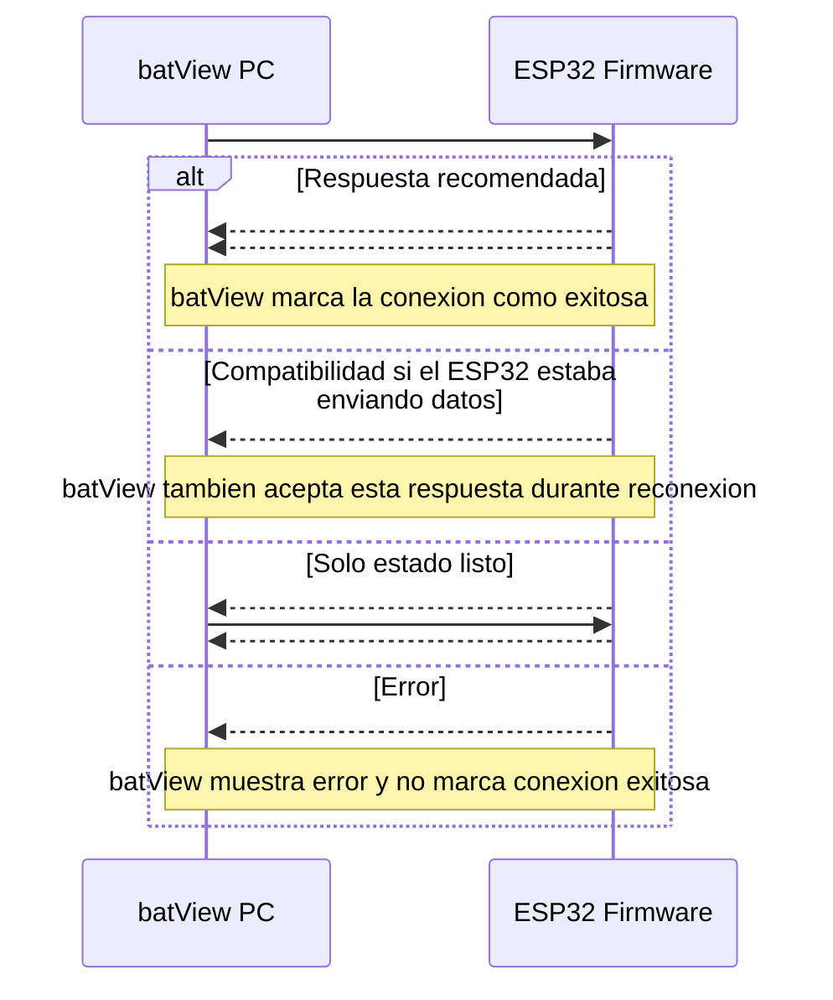
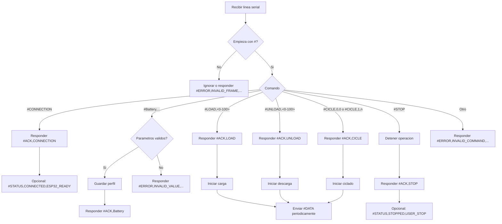

# Protocolo de comunicacion ESP32 <-> batView

Este documento describe el protocolo serial que debe implementar el firmware del
ESP32 para comunicarse correctamente con la aplicacion de escritorio batView.

## 1. Configuracion serial

- Medio: USB/UART.
- Baud rate: `115200`.
- Formato: `8N1`.
- Control de flujo: ninguno.
- Codificacion: texto ASCII/UTF-8 simple.
- Cada trama debe enviarse como una linea completa.
- Cada linea debe terminar con salto de linea `\n`.
- Se permite `\r\n`, pero se recomienda usar solo `\n`.

Todas las tramas validas empiezan con `#`.

Ejemplo:

```text
#ACK,CONNECTION\n
```

## 2. Reglas generales de formato

1. No agregar espacios antes, despues ni entre campos.
2. Separar campos con coma `,`.
3. No usar comas dentro de campos de texto.
4. Enviar una sola trama por linea.
5. Responder cada comando del PC con un `#ACK,...` o un `#ERROR,...`.
6. Los nombres de comandos y ACK deben respetar mayusculas y minusculas como se
   muestran en este documento.

batView es tolerante durante la conexion inicial y acepta algunas variantes
historicas, pero el firmware nuevo debe seguir la forma recomendada.

## 3. Comandos enviados por batView al ESP32

### 3.1 Conexion

batView envia:

```text
#CONNECTION
```

Respuesta recomendada del ESP32:

```text
#ACK,CONNECTION
```

Compatibilidad aceptada por batView durante conexion:

```text
#ACK,CONECTION
#ACK,DATA
```

`#ACK,CONECTION` se acepta por compatibilidad con un typo anterior. No usarlo en
firmware nuevo.

`#ACK,DATA` se acepta durante reconexion porque algunos firmware quedan en modo
de telemetria y responden asi al recibir `#CONNECTION`. Aun asi, la respuesta
recomendada para firmware nuevo es siempre `#ACK,CONNECTION`.

### 3.2 Perfil de bateria

batView envia:

```text
#Battery,<BatteryNameID>,<Vmax>,<Vmin>,<Amax>
```

Campos:

| Campo | Tipo | Descripcion |
|---|---|---|
| `BatteryNameID` | texto sin comas | Identificador del perfil de bateria. |
| `Vmax` | decimal | Tension maxima de la bateria. Debe ser mayor que `0`. |
| `Vmin` | decimal | Tension minima de la bateria. Debe ser mayor que `0` y menor que `Vmax`. |
| `Amax` | decimal | Corriente maxima permitida. Debe ser mayor que `0`. |

Ejemplo:

```text
#Battery,LiIon_1S,4.2,3.0,1.5
```

Respuesta esperada:

```text
#ACK,Battery
```

### 3.3 Carga

batView envia:

```text
#LOAD,<targetPercent>
```

Campos:

| Campo | Tipo | Descripcion |
|---|---|---|
| `targetPercent` | entero `0` a `100` | Porcentaje objetivo de carga. |

Ejemplo:

```text
#LOAD,80
```

Respuesta esperada:

```text
#ACK,LOAD
```

Despues del ACK, el ESP32 puede empezar a enviar telemetria `#DATA`.

### 3.4 Descarga

batView envia:

```text
#UNLOAD,<targetPercent>
```

Campos:

| Campo | Tipo | Descripcion |
|---|---|---|
| `targetPercent` | entero `0` a `100` | Porcentaje objetivo de descarga. |

Ejemplo:

```text
#UNLOAD,20
```

Respuesta esperada:

```text
#ACK,UNLOAD
```

Despues del ACK, el ESP32 puede empezar a enviar telemetria `#DATA`.

### 3.5 Ciclado

batView soporta dos modos de ciclado.

Modo infinito:

```text
#CICLE,0,0
```

Modo finito:

```text
#CICLE,1,<cycleCount>
```

Campos:

| Campo | Tipo | Descripcion |
|---|---|---|
| Primer campo | `0` o `1` | `0` significa infinito, `1` significa numero fijo de ciclos. |
| `cycleCount` | entero positivo | Cantidad de ciclos cuando el primer campo es `1`. En modo infinito debe ser `0`. |

Ejemplos:

```text
#CICLE,0,0
#CICLE,1,5
```

Respuesta esperada:

```text
#ACK,CICLE
```

Despues del ACK, el ESP32 puede empezar a enviar telemetria `#DATA`.

Nota: el comando se escribe `CICLE`, no `CYCLE`, porque asi esta definido en la
aplicacion actual.

### 3.6 Detener operacion

batView envia:

```text
#STOP
```

Respuesta esperada:

```text
#ACK,STOP
```

Despues de `#ACK,STOP`, el ESP32 debe detener carga, descarga, ciclado y envio de
telemetria continua.

## 4. Tramas enviadas por el ESP32 al PC

### 4.1 ACK

Formato:

```text
#ACK,<token>
```

ACK esperados:

| Comando recibido | ACK que debe responder el ESP32 |
|---|---|
| `#CONNECTION` | `#ACK,CONNECTION` |
| `#Battery,...` | `#ACK,Battery` |
| `#LOAD,...` | `#ACK,LOAD` |
| `#UNLOAD,...` | `#ACK,UNLOAD` |
| `#CICLE,...` | `#ACK,CICLE` |
| `#STOP` | `#ACK,STOP` |

Regla importante: el ACK debe enviarse cuando el comando fue recibido, entendido
y aceptado. Si el comando no se puede ejecutar, enviar `#ERROR,...` en lugar de
un ACK.

### 4.2 Estado

Formato:

```text
#STATUS,<state>,<detail>
```

Campos:

| Campo | Tipo | Descripcion |
|---|---|---|
| `state` | texto sin comas | Estado general del ESP32. |
| `detail` | texto sin comas | Detalle adicional. |

Ejemplos recomendados:

```text
#STATUS,CONNECTED,ESP32_READY
#STATUS,CHARGING,PROCESS_ACTIVE
#STATUS,DISCHARGING,PROCESS_ACTIVE
#STATUS,CYCLING,PROCESS_ACTIVE
#STATUS,FINISHED,CYCLE_COMPLETE
#STATUS,STOPPED,USER_STOP
```

Durante la conexion, batView reconoce como senal de dispositivo listo cualquier
`#STATUS,...` que contenga `ESP32_READY` o `CONNECTED`.

### 4.3 Error

Formato:

```text
#ERROR,<code>,<message>
```

Campos:

| Campo | Tipo | Descripcion |
|---|---|---|
| `code` | texto o numero sin comas | Codigo corto del error. |
| `message` | texto sin comas | Descripcion del error. |

Ejemplos:

```text
#ERROR,INVALID_COMMAND,Comando no reconocido
#ERROR,INVALID_VALUE,Porcentaje fuera de rango
#ERROR,NOT_READY,Perfil de bateria no configurado
```

Si el ESP32 envia `#ERROR,...`, batView considera fallido el comando que estaba
esperando ACK.

### 4.4 Telemetria

Formato corto:

```text
#DATA,<voltage>,<current>,<timestampMs>
```

Formato extendido:

```text
#DATA,<voltage>,<current>,<timestampMs>,<state>,<completedCycles>
```

Campos:

| Campo | Tipo | Descripcion |
|---|---|---|
| `voltage` | decimal | Tension medida por el ESP32. |
| `current` | decimal | Corriente medida por el ESP32. |
| `timestampMs` | entero o decimal | Tiempo en milisegundos generado por el ESP32. |
| `state` | entero | Estado operativo definido por el firmware. Solo en formato extendido. |
| `completedCycles` | entero | Ciclos completados. Solo en formato extendido. |

Ejemplos:

```text
#DATA,4.12,0.85,1520
#DATA,4.10,0.82,1770,1,3
```

Notas importantes:

- batView no inventa ni recalcula `voltage`, `current` ni `timestampMs`.
- batView guarda el `timestampMs` recibido y solo lo convierte a segundos para
  graficar.
- No enviar `#DATA` antes de responder el ACK del comando que inicia la
  operacion.
- Durante una operacion activa, el ESP32 puede enviar `#DATA` continuamente.
- Despues de `#STOP` y `#ACK,STOP`, detener el envio continuo de `#DATA`.

## 5. Flujo recomendado de sesion

### 5.0 Diagrama general



### 5.1 Conexion inicial

```text
PC:    #CONNECTION
ESP32: #ACK,CONNECTION
ESP32: #STATUS,CONNECTED,ESP32_READY
```

### 5.2 Seleccion de bateria

```text
PC:    #Battery,LiIon_1S,4.2,3.0,1.5
ESP32: #ACK,Battery
```

### 5.3 Inicio de carga

```text
PC:    #LOAD,80
ESP32: #ACK,LOAD
ESP32: #STATUS,CHARGING,PROCESS_ACTIVE
ESP32: #DATA,3.85,0.65,1000
ESP32: #DATA,3.86,0.66,2000
```

### 5.4 Detener operacion

```text
PC:    #STOP
ESP32: #ACK,STOP
ESP32: #STATUS,STOPPED,USER_STOP
```

## 6. Flujo recomendado de reconexion

### 6.1 Diagrama de reconexion



Cuando batView presiona `Reconectar`, vuelve a abrir el puerto serial y envia:

```text
PC: #CONNECTION
```

El ESP32 debe responder preferiblemente:

```text
ESP32: #ACK,CONNECTION
```

Si el firmware esta en modo telemetria o acaba de salir de una operacion, batView
tambien acepta:

```text
ESP32: #ACK,DATA
```

Sin embargo, para evitar ambiguedades, se recomienda que el firmware haga esto
cuando recibe `#CONNECTION`:

1. Pausar temporalmente el envio de telemetria.
2. Responder `#ACK,CONNECTION`.
3. Enviar opcionalmente `#STATUS,CONNECTED,ESP32_READY`.
4. Esperar el siguiente comando del PC.

Flujo ideal:

```text
PC:    #CONNECTION
ESP32: #ACK,CONNECTION
ESP32: #STATUS,CONNECTED,ESP32_READY
```

## 7. Timeouts y reintentos de batView

Durante conexion:

- batView abre el puerto serial.
- Envia `#CONNECTION`.
- Espera hasta 6 segundos por una respuesta valida.
- Reenvia `#CONNECTION` aproximadamente cada 1.2 segundos mientras espera.
- Acepta como conexion valida:
  - `#ACK,CONNECTION`
  - `#ACK,CONECTION`
  - `#ACK,DATA`
  - `#STATUS,...` con `ESP32_READY` o `CONNECTED`, pero en ese caso reintenta el
    handshake enviando de nuevo `#CONNECTION`.

Para comandos normales:

- batView espera el ACK correspondiente.
- Si llega `#ERROR,...`, el comando falla.
- Si llega un ACK distinto al esperado, batView lo ignora y sigue esperando el
  ACK correcto hasta timeout.

## 8. Resumen rapido para firmware

### 8.1 Diagrama de decision del firmware



Implementar como minimo:

```text
Si recibe #CONNECTION:
    responder #ACK,CONNECTION

Si recibe #Battery,...:
    validar parametros
    responder #ACK,Battery o #ERROR,...

Si recibe #LOAD,<0-100>:
    responder #ACK,LOAD
    iniciar carga
    enviar #DATA,...

Si recibe #UNLOAD,<0-100>:
    responder #ACK,UNLOAD
    iniciar descarga
    enviar #DATA,...

Si recibe #CICLE,0,0 o #CICLE,1,<cycleCount>:
    responder #ACK,CICLE
    iniciar ciclado
    enviar #DATA,...

Si recibe #STOP:
    detener operacion
    responder #ACK,STOP
```

Regla mas importante: para `#CONNECTION`, responder siempre
`#ACK,CONNECTION`, incluso si el ESP32 ya estaba conectado o enviando datos.
