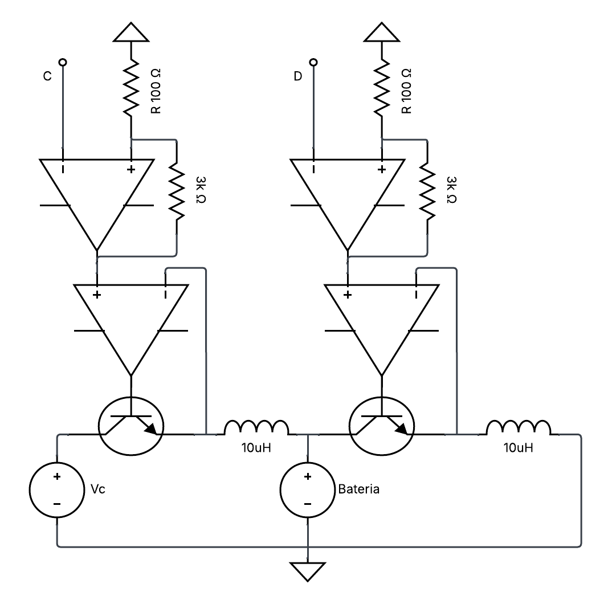

## Diseño del circuito

La topología implementada se muestra en la **Figura 1**. En el lado izquierdo se encuentra el circuito encargado de la carga de la batería, mientras que en el lado derecho se ubica el circuito de descarga.

Ambas etapas presentan una estructura similar, debido a que en los dos casos se requiere controlar la corriente que circula hacia o desde la batería.

### 1. Etapa de carga

Al analizar la trayectoria de corriente del circuito de carga en sentido horario, se encuentran los siguientes elementos:

1. **Fuente de tensión:** proporciona la energía necesaria para cargar la batería.
2. **Transistor de potencia:** regula el paso de corriente mediante su conmutación.
3. **Inductor:** limita las variaciones bruscas de corriente y almacena energía.
4. **Batería:** recibe la corriente suministrada por el circuito de carga.

Desde el punto de vista del sistema de control, el transistor corresponde al **actuador**, ya que modifica la corriente del circuito según la señal de control aplicada.

### 2. Etapa de descarga

La etapa de descarga presenta una estructura semejante a la etapa de carga. En este caso, el transistor regula la corriente que sale de la batería, mientras que el inductor limita sus variaciones bruscas.

Debido a la relación entre la tensión aplicada al inductor y la variación de su corriente, es posible controlar la corriente de carga o descarga mediante la conmutación del transistor.

### 3. Acondicionamiento de la señal de control

La señal de control proveniente del ESP32 posee un rango de tensión entre **0 V y 3.3 V**.

Esta señal se introduce en un amplificador operacional configurado como **amplificador no inversor**, formado por resistencias de **1 kΩ** y **3.3 kΩ**. La ganancia del amplificador es:

$$
A_v = 1 + \frac{3\ \text{k}\Omega}{1\ \text{k}\Omega} = 4.3
$$

Por lo tanto, la tensión máxima de salida es aproximadamente:

$$
V_{\text{salida}} = 4.3(3.3\ \text{V}) = 14.2\ \text{V}
$$

### 4. Accionamiento del transistor

La amplificación es necesaria para proporcionar un nivel de tensión adecuado para el accionamiento del transistor.

Durante los procesos de carga y descarga, la tensión de control debe ser suficientemente alta con respecto al nodo ubicado entre el transistor y el inductor. Esto permite:

* Garantizar la correcta activación del transistor.
* Regular la corriente del circuito.
* Controlar la corriente que circula hacia o desde la batería.

## Diagrama del circuito

*Figura 1. Topología del circuito de carga y descarga de la batería.*

## Función de transferencia

### 1. Ecuación de tensiones

Aplicando la **Ley de Voltajes de Kirchhoff** en sentido horario sobre el circuito de carga, se obtiene:

$$
-v_C(t)+v_T(t)+v_L(t)+v_R(t)+v_B(t)=0
$$

La tensión en el inductor se expresa como:

$$
v_L(t)=L\frac{di_L(t)}{dt}
$$

Por otra parte, la caída de tensión en la resistencia parásita está dada por:

$$
v_R(t)=R\cdot i_L(t)
$$

Sustituyendo ambas expresiones:

$$
-v_C(t)+v_T(t)+L\frac{di_L(t)}{dt}+R\cdot i_L(t)+v_B(t)=0
$$

Al reorganizar:

$$
L\frac{di_L(t)}{dt}+R\cdot i_L(t) = v_C(t)-v_T(t)-v_B(t)
$$

### 2. Transformada de Laplace

Aplicando la transformada de Laplace con condiciones iniciales iguales a cero:

$$
LsI_L(s)+RI_L(s) = V_C(s)-V_T(s)-V_B(s)
$$

Factorizando:

$$
I_L(s)(Ls+R) = V_C(s)-V_T(s)-V_B(s)
$$

Despejando la corriente:

$$
I_L(s) = \frac{V_C(s)-V_T(s)-V_B(s)}{Ls+R}
$$

### 3. Función de transferencia

Se define la entrada efectiva como:

$$
U(s)=V_C(s)-V_T(s)-V_B(s)
$$

Entonces:

$$
H(s) = \frac{I_L(s)}{U(s)} = \frac{1}{Ls+R}
$$

La forma estándar es:

$$
H(s) = \frac{\frac{1}{R}}{\frac{L}{R}s+1} = \frac{K}{\tau s+1}
$$

donde:

$$
K=\frac{1}{R}
$$

$$
\tau=\frac{L}{R}
$$

