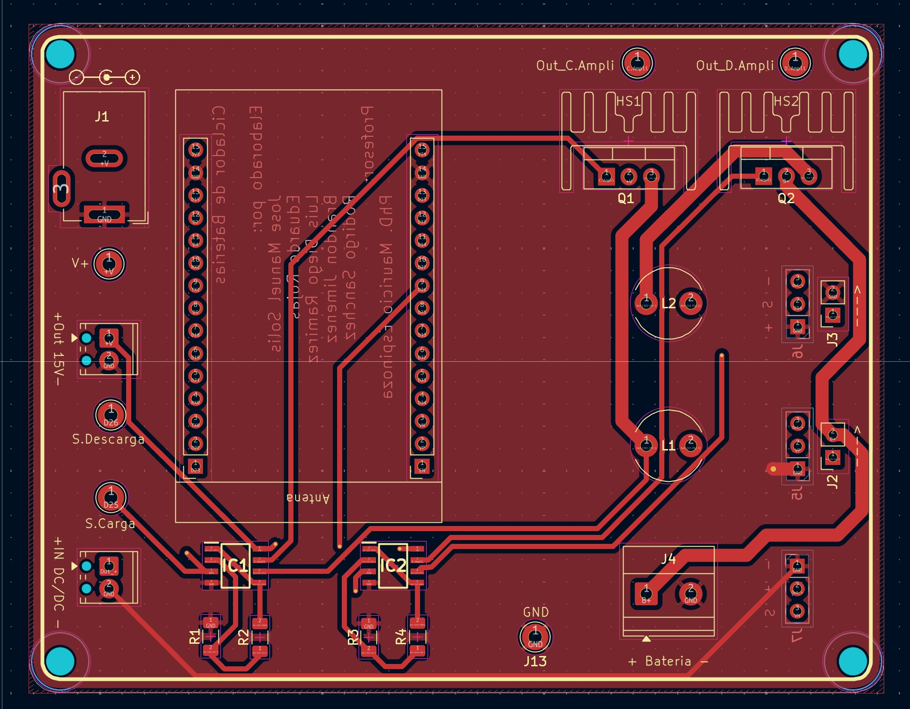
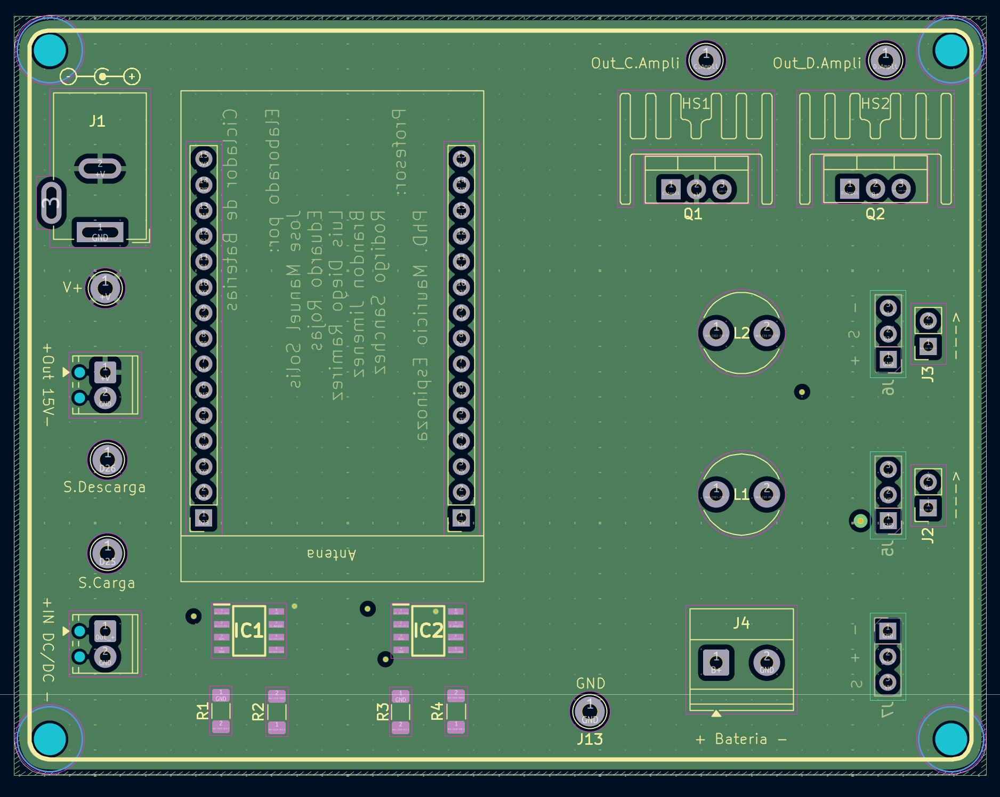
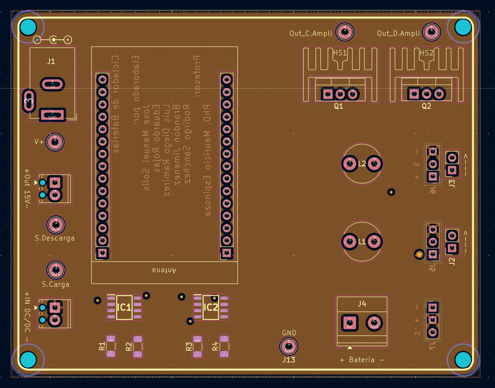
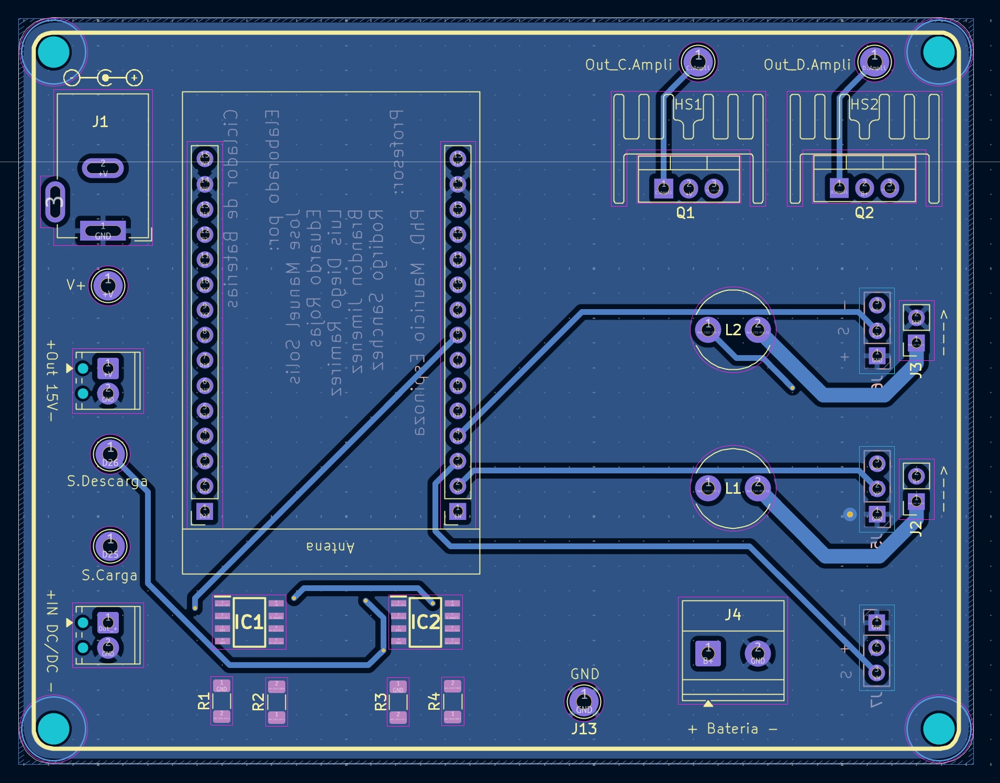

# PCB del ciclador de baterías

## Descripción general

En este directorio se encuentran los archivos de diseño de la PCB utilizada
para implementar el prototipo del ciclador de baterías.

La placa integra las etapas principales necesarias para realizar los procesos
de carga y descarga de la batería. Además, permite conectar el ESP32, los
sensores de corriente, el sensor de tensión, el convertidor de tensión externo,
la alimentación principal y la batería.

El diseño fue realizado en KiCad y utiliza cuatro capas de cobre:

- `F.Cu`: capa superior.
- `In1.Cu`: primera capa interna.
- `In2.Cu`: segunda capa interna.
- `B.Cu`: capa inferior.

Los archivos principales del proyecto son:

- `Proyecto.kicad_pro`: archivo principal del proyecto de KiCad.
- `Proyecto.kicad_sch`: esquemático eléctrico del circuito.
- `Proyecto.kicad_pcb`: diseño físico de la PCB.
- `symbols/`: símbolos personalizados utilizados en el esquemático.
- `footprints/`: huellas personalizadas utilizadas en la PCB.
- `3dmodels/`: modelos tridimensionales de los componentes.
- `Imagenes/`: imágenes de las capas y vistas tridimensionales de la PCB.

## Distribución general de la PCB

La PCB está organizada para separar las etapas de control, medición y potencia.

En la parte central de la placa se ubica el ESP32, el cual se encarga de
ejecutar el sistema de control. En el lado derecho se encuentran los
transistores de potencia, los disipadores, los inductores y las terminales
relacionadas con la batería y los sensores. En el lado izquierdo se ubican las
entradas de alimentación, las señales de control y las conexiones asociadas al
convertidor externo de tensión.

## Vista superior de la PCB

*Figura 1. Vista superior del prototipo de la PCB.*

En la vista superior se observa la distribución física de los componentes
principales del prototipo.

En el centro de la placa se encuentra el módulo ESP32. Este microcontrolador
recibe las señales de los sensores, ejecuta el algoritmo de control y genera
las señales necesarias para activar las etapas de carga y descarga.

En la parte superior derecha se encuentran los transistores de potencia `Q1` y
`Q2`. Estos transistores controlan el paso de corriente durante los procesos de
carga y descarga de la batería. Debido a que pueden disipar potencia durante su
funcionamiento, cada uno cuenta con un disipador de calor.

Debajo de los transistores se encuentran los inductores `L1` y `L2`. Estos
elementos forman parte de las trayectorias de potencia y permiten limitar las
variaciones bruscas de corriente.

En la parte inferior de la placa se observan los circuitos integrados `IC1` e
`IC2`, junto con las resistencias `R1`, `R2`, `R3` y `R4`. Estos componentes
forman las etapas de acondicionamiento y amplificación de las señales de
control provenientes del ESP32.

También se encuentran puntos de prueba para verificar señales importantes del
sistema:

- `S.Carga`: señal de control para la etapa de carga.
- `S.Descarga`: señal de control para la etapa de descarga.
- `Out_C.Ampli`: salida amplificada de la etapa de carga.
- `Out_D.Ampli`: salida amplificada de la etapa de descarga.
- `V+`: punto de medición de tensión positiva.
- `GND`: referencia común del circuito.

## Vista inferior de la PCB

*Figura 2. Vista inferior del prototipo de la PCB.*

La vista inferior permite observar la parte posterior de la placa, donde se
aprecian las conexiones de los pines, los puntos de soldadura y las rutas que
comunican los diferentes bloques del circuito.

Esta vista es útil durante el ensamblaje porque permite revisar la orientación
de los conectores, verificar los puntos de soldadura y comprobar que no existan
cortocircuitos entre terminales cercanas.

También permite observar cómo se conectan físicamente los módulos externos a la
PCB, como el ESP32, los conectores de sensores, la alimentación y la batería.

## Conectores principales de la PCB

La placa cuenta con varios conectores que permiten integrar el prototipo final.

### Conector negro de alimentación principal

El conector negro ubicado en la esquina superior izquierda corresponde a la
alimentación principal de la PCB.

En este conector se conecta la fuente que alimenta el circuito completo. Esta
alimentación se utiliza para las etapas principales de potencia y para generar
las tensiones necesarias en el resto del sistema.

Antes de energizar la PCB se debe verificar la polaridad del conector y
confirmar con un multímetro que no exista cortocircuito entre la alimentación y
`GND`.

### Conectores verdes pequeños para el convertidor de 15 V a 5 V

En el lado izquierdo de la PCB se tienen dos conectores verdes pequeños. Estos
se utilizan para conectar un convertidor externo de tensión de `15 V` a `5 V`.

La idea es que la PCB entregue una tensión de `15 V` hacia el convertidor y que
el convertidor devuelva una tensión regulada de `5 V`. Esta tensión de `5 V` se
utiliza para alimentar los sensores del sistema.

Las conexiones se identifican como:

- `Out 15V`: salida de `15 V` desde la PCB hacia el convertidor.
- `IN DC/DC`: entrada de `5 V` desde el convertidor hacia la PCB.

La conexión general es la siguiente:

flowchart LR
    A["PCB Out 15 V"] -->|"15 V"| B["Convertidor externo 15 V a 5 V"]
    B -->|"5 V"| C["PCB IN DC/DC"]
    C --> D["Alimentación de sensores"]
    G["GND común"] --- B
    G --- D

*Figura 3. Conexión del convertidor externo de 15 V a 5 V.*

Es importante respetar la polaridad marcada en la PCB. Si el convertidor se
conecta de forma incorrecta, se pueden dañar los sensores o el ESP32.

### Terminal verde para la batería

La batería se conecta en la terminal verde identificada como `J4`, ubicada en
la parte inferior derecha de la PCB.

La polaridad está indicada en la serigrafía de la placa:

+ Batería -

El terminal positivo de la batería debe conectarse al lado marcado con `+` y el
terminal negativo debe conectarse al lado marcado con `-`.

Antes de conectar una batería real se recomienda comprobar la polaridad con un
multímetro.

## Sensores del sistema

El prototipo utiliza sensores de corriente y un sensor de tensión. Estos
sensores permiten que el ESP32 conozca el estado eléctrico del circuito y pueda
calcular la acción de control correspondiente.

### Sensores de corriente

Los sensores de corriente se conectan abriendo la trayectoria de potencia. Para
esto se utilizan las terminales negras ubicadas en la parte superior de los
módulos de sensor.

La corriente que se desea medir debe pasar a través del sensor. Por eso, el
sensor de corriente se conecta en serie con la trayectoria de carga o descarga.

La conexión general es:

flowchart LR
    A["Etapa de carga o descarga"] --> B["Terminal negra entrada del sensor"]
    B --> C["Sensor de corriente"]
    C --> D["Terminal negra salida del sensor"]
    D --> E["Batería o carga"]

    F["5 V"] --> C
    G["GND"] --> C
    C -->|"Señal analógica"| H["ADC del ESP32"]

*Figura 4. Conexión del sensor de corriente en serie con el circuito.*

Cada sensor de corriente requiere:

- Alimentación de `5 V`.
- Conexión a `GND`.
- Conexión de la señal analógica hacia el ESP32.
- Conexión en serie con la trayectoria de corriente que se desea medir.

En el prototipo se utilizan sensores independientes para medir la corriente de
carga y la corriente de descarga.

### Sensor de tensión

El sensor de tensión se conecta directamente en paralelo con la batería. A
diferencia del sensor de corriente, no es necesario abrir la trayectoria de
potencia.

La conexión general es:

flowchart LR
    A["Positivo de batería"] --> B["Entrada positiva del sensor de tensión"]
    C["Negativo de batería"] --> D["Entrada negativa del sensor de tensión"]

    B --> E["Sensor de tensión"]
    D --> E

    F["5 V"] --> E
    G["GND"] --> E
    E -->|"Señal proporcional 0 V a 3.3 V"| H["ADC del ESP32"]

*Figura 5. Conexión del sensor de tensión en paralelo con la batería.*

El sensor de tensión mide la diferencia de potencial entre los terminales de la
batería y entrega una señal proporcional al ESP32.

La salida del sensor debe mantenerse dentro del rango permitido por el ESP32,
es decir, entre `0 V` y `3.3 V`.

## Conexión general del prototipo final

La conexión completa del prototipo se resume en el siguiente diagrama:

flowchart TB
    A["Fuente principal"] --> B["Conector negro de alimentación"]
    B --> C["PCB del ciclador"]

    C -->|"15 V"| D["Convertidor externo 15 V a 5 V"]
    D -->|"5 V"| E["Sensores"]

    F["ESP32"] -->|"S.Carga"| G["Amplificador de carga"]
    F -->|"S.Descarga"| H["Amplificador de descarga"]

    G --> I["Transistor de carga"]
    H --> J["Transistor de descarga"]

    I --> K["Inductor de carga"]
    J --> L["Inductor de descarga"]

    K --> M["Sensor de corriente de carga"]
    L --> N["Sensor de corriente de descarga"]

    M --> O["Batería J4"]
    O --> N

    O --- P["Sensor de tensión"]

    M -->|"Corriente de carga medida"| F
    N -->|"Corriente de descarga medida"| F
    P -->|"Tensión de batería medida"| F

    E --> M
    E --> N
    E --> P

*Figura 6. Conexión general del prototipo final.*

El funcionamiento general del sistema es el siguiente:

1. La fuente principal alimenta la PCB mediante el conector negro.
2. La PCB entrega `15 V` hacia el convertidor externo.
3. El convertidor genera `5 V` para alimentar los sensores.
4. El ESP32 genera las señales `S.Carga` y `S.Descarga`.
5. Las señales del ESP32 pasan por las etapas de amplificación.
6. Las etapas amplificadas accionan los transistores de potencia.
7. Los inductores limitan las variaciones bruscas de corriente.
8. Los sensores de corriente miden la corriente de carga y descarga.
9. El sensor de tensión mide la tensión directamente en la batería.
10. Las señales medidas regresan al ESP32 para cerrar el lazo de control.

## Capa superior de cobre

*Figura 7. Capa superior de cobre `F.Cu`.*

La capa superior contiene parte del enrutamiento principal de la PCB.

En esta imagen se observan las pistas que conectan el ESP32 con las etapas de
control, las etapas de amplificación con los transistores y las trayectorias de
potencia hacia los inductores y conectores externos.

Las pistas de mayor ancho corresponden a trayectorias donde puede circular una
corriente más alta. Las pistas más delgadas corresponden principalmente a
señales de control, medición y comunicación entre bloques.

## Primera capa interna

*Figura 8. Primera capa interna `In1.Cu`.*

La primera capa interna corresponde a una zona de cobre utilizada para mejorar
la distribución eléctrica dentro de la PCB.

Esta capa ayuda a reducir la impedancia de las conexiones internas y permite
tener una referencia más uniforme para diferentes secciones del circuito.

También contribuye a separar las señales de control de las trayectorias de
potencia.

## Segunda capa interna

*Figura 9. Segunda capa interna `In2.Cu`.*

La segunda capa interna complementa la distribución de la alimentación y de las
referencias eléctricas del circuito.

Al utilizar una PCB de cuatro capas, se facilita la conexión entre los
componentes y se mejora la organización de las rutas internas. Esto permite
tener un diseño más limpio y con menor interferencia entre las señales de
potencia y las señales del ESP32.

## Capa inferior de cobre

*Figura 10. Capa inferior de cobre `B.Cu`.*

La capa inferior completa las conexiones que no se realizan en la capa
superior.

En esta imagen se observan rutas entre el ESP32, los circuitos integrados, los
transistores, los inductores, los conectores de sensores y la terminal de la
batería.

La combinación de las cuatro capas permite distribuir mejor las conexiones,
mantener referencias eléctricas más estables y separar de mejor manera las
señales de control de las trayectorias de corriente.

## Secuencia recomendada de conexión

Para conectar el prototipo se recomienda seguir el siguiente orden:

1. Mantener la batería desconectada.
2. Conectar la fuente principal al conector negro de alimentación.
3. Verificar la tensión de entrada y la polaridad.
4. Conectar el convertidor externo de `15 V` a `5 V`.
5. Verificar que la salida del convertidor sea de `5 V`.
6. Conectar la alimentación de los sensores.
7. Conectar los sensores de corriente en serie usando las terminales negras.
8. Conectar el sensor de tensión directamente a los terminales de la batería.
9. Instalar el ESP32 en la PCB.
10. Verificar las señales `S.Carga` y `S.Descarga`.
11. Verificar las salidas `Out_C.Ampli` y `Out_D.Ampli`.
12. Conectar la batería respetando la polaridad indicada en `J4`.
13. Iniciar las pruebas con corriente limitada.

## Uso de los archivos de KiCad

Para abrir el proyecto completo se debe utilizar el archivo:

Proyecto.kicad_pro

Este archivo permite abrir el diseño completo en KiCad.

El esquemático eléctrico se encuentra en:

Proyecto.kicad_sch

El diseño físico de la PCB se encuentra en:

Proyecto.kicad_pcb

Las carpetas `symbols`, `footprints` y `3dmodels` deben mantenerse junto con el
proyecto, ya que contienen elementos utilizados por el diseño.

## Advertencia

Este diseño corresponde a un prototipo académico. Antes de conectar una batería
real se deben revisar cuidadosamente las conexiones, la polaridad, los niveles
de tensión, las corrientes máximas y el funcionamiento del sistema de control.

Una conexión incorrecta puede dañar la PCB, el ESP32, los sensores, los
transistores o la batería.

