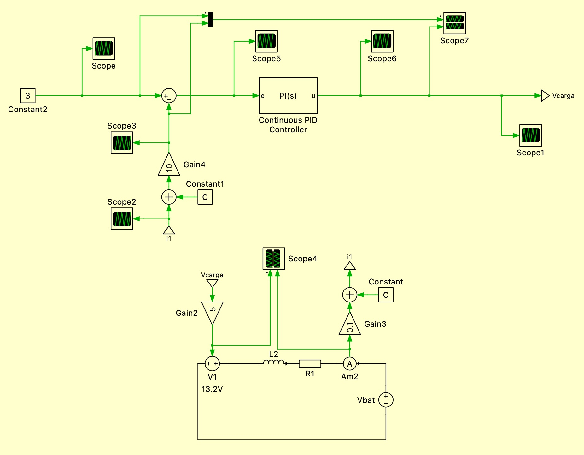
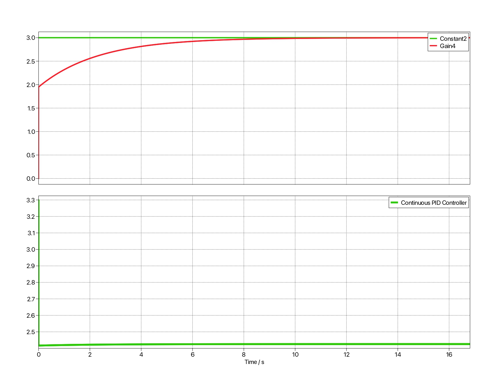
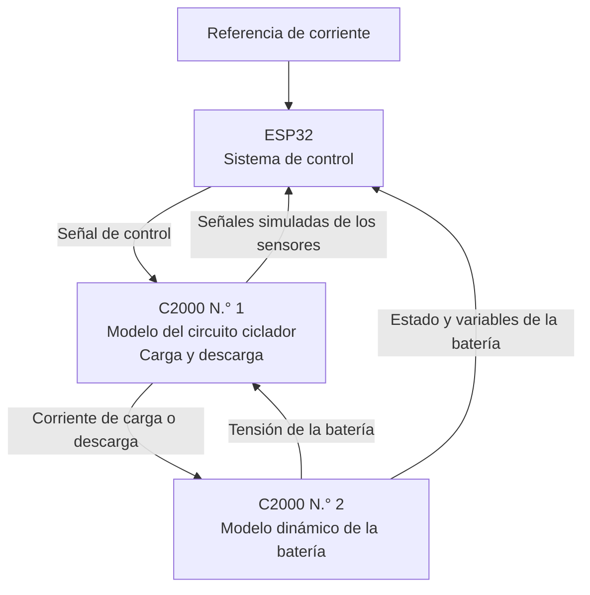
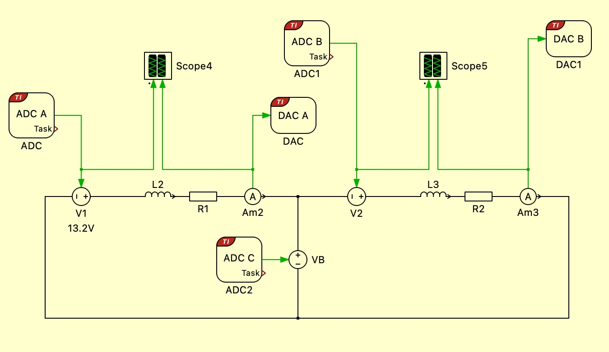
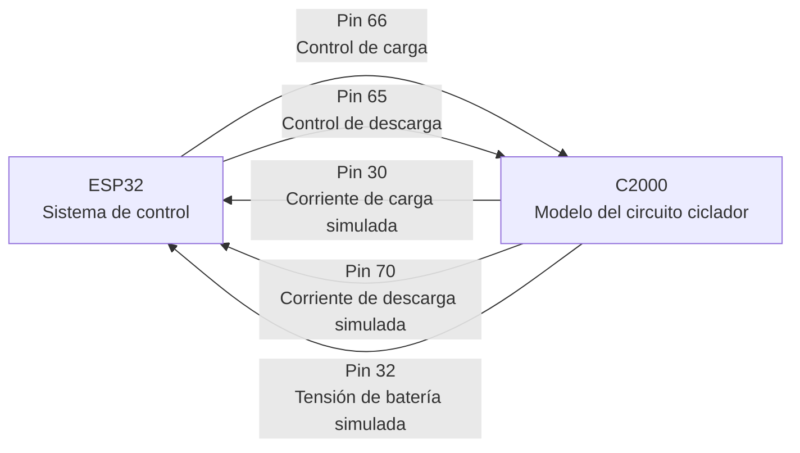
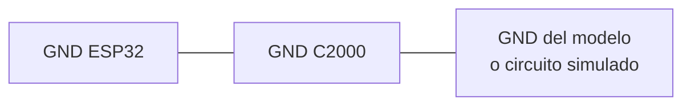

## Simulaciones

Para validar el funcionamiento del circuito ciclador y preparar la
implementación del sistema de control, se desarrollaron dos modelos principales
en PLECS: `simulacion_control` y `hardware_in_the_loop`.

### Simulación del sistema de control

El archivo `simulacion_control` contiene el modelo del circuito de carga de la
batería junto con su respectivo lazo de control de corriente.

En esta simulación se implementa un controlador PI acompañado de una rama de
prealimentación. El controlador recibe como entrada la diferencia entre la
corriente de referencia y la corriente medida en el inductor. A partir de este
error, genera la señal de control necesaria para accionar el transistor de
potencia y regular la corriente suministrada a la batería.

La rama de prealimentación utiliza información del circuito para generar una
acción de control inicial cercana al valor requerido. Por su parte, el
controlador PI corrige el error restante y compensa las perturbaciones o
variaciones que puedan presentarse durante el proceso de carga.

El objetivo principal de esta simulación es comprobar que la corriente del
inductor pueda seguir adecuadamente la referencia establecida, manteniendo una
respuesta estable y evitando cambios bruscos que puedan afectar la batería o
los componentes del circuito.

Mediante este modelo se pueden analizar aspectos como:

- El seguimiento de la corriente de referencia.
- El tiempo de establecimiento del sistema.
- El sobreimpulso de la corriente.
- La respuesta ante cambios en la referencia.
- La capacidad del controlador para corregir perturbaciones.
- El comportamiento de la tensión de control aplicada al transistor.

Esta simulación permite ajustar los parámetros del controlador antes de
realizar pruebas con el circuito físico.

En la **Figura 1** se tiene el sistema de control utilizado junto con el circuito de simulación en donde se simula el comportamiento de los sensores de corriente para recibir en el sistema de control las mismas señales que va recibir el ESP32, por lo que las señales que se simulan son proporcionales a las que se van a tener las pruebas de `hardware_in_the_loop` y en el circuito físico. 

En la **Figura 2** se tienen dos gráficas, la de arriba muesta en verde la referencia de corriente y la roja muestra la corriente medida del sensor de carga. En donde se puede ver que la señal logra seguir correctamente la referencia sin generar sobresalto y con error en estadoe stacionario de cero.
Por otro lado, en la gráfica de abajo se tiene la señal de salida del controlador PI, la cual es bastante pequeña debido a que el error se corrige antes de entrar al control PI, por lo que el control es bastante eficiente por el hecho de que se puede medir la perdutbación y corregirla desde antes, logrnado un sistema mas estable ante perturbaciones. 

### Simulación Hardware-in-the-Loop

El archivo `hardware_in_the_loop` contiene una propuesta de simulación en tiempo
real del sistema completo mediante una arquitectura
**Hardware-in-the-Loop (HIL)**.

El objetivo de esta prueba es representar mediante microcontroladores las
diferentes partes del sistema antes de conectar el controlador desarrollado por
el grupo a la PCB y a una batería física.

La arquitectura propuesta estará formada por tres elementos principales:

1. **C2000 encargado del circuito ciclador:** ejecutará en tiempo real el modelo
   eléctrico del circuito implementado en la PCB. Este modelo representará el
   comportamiento del transistor, el inductor, las resistencias y los demás
   componentes de la etapa de potencia.

2. **C2000 encargado del modelo de la batería:** ejecutará el modelo dinámico de
   la batería y calculará su respuesta ante la corriente de carga o descarga
   recibida desde el modelo del circuito.

3. **ESP32 encargado del sistema de control:** ejecutará el algoritmo de control
   diseñado por el equipo de programación. El ESP32 recibirá las variables
   medidas del sistema, calculará la acción de control y enviará la señal
   correspondiente al modelo del circuito ciclador.

De esta manera, el primer C2000 simulará el comportamiento de la PCB, el segundo
C2000 simulará el comportamiento de la batería y el ESP32 realizará el control
de corriente.

La simulación HIL permitirá evaluar el controlador utilizando señales y
dispositivos físicos, pero sin conectar inicialmente una batería real ni la
etapa de potencia definitiva.

Con esta prueba se busca verificar:

* La comunicación entre los microcontroladores.
* La correcta lectura de las señales de tensión y corriente.
* La generación de la señal de control por parte del ESP32.
* El seguimiento de la corriente de referencia.
* La respuesta del controlador ante perturbaciones.
* El escalamiento de las señales analógicas entre los dispositivos.
* La estabilidad del sistema durante los procesos de carga y descarga.
* El comportamiento del controlador antes de conectarlo a la PCB física.

Esta arquitectura reduce el riesgo de dañar la batería, la PCB o los
componentes de potencia durante las primeras pruebas. Además, permite detectar
errores de programación, comunicación, escalamiento y control antes de realizar
la integración final del sistema.

En la **Figura 3** se tiene el circuito utilizado para hacer las pruebas hardware in the loop con sus respectivos puertos para comunicación con el C2000. 

### Conexión para la prueba Hardware-in-the-Loop

Para realizar la prueba **Hardware-in-the-Loop**, el modelo del circuito
ciclador se ejecuta en el C2000. Este C2000 recibe desde el ESP32 las señales
de control de carga y descarga, y devuelve al ESP32 las señales simuladas de
los sensores.

De esta forma, el ESP32 trabaja como si estuviera conectado a la PCB física,
pero en realidad las señales de corriente y tensión son generadas por el modelo
del circuito ejecutado en el C2000.

La conexión entre el ESP32 y el C2000 se realiza mediante señales analógicas.
Las señales de control salen desde el ESP32 hacia el C2000, mientras que las
señales simuladas de sensores salen desde el C2000 hacia el ESP32.

| Pin del C2000 | Dirección de la señal | Descripción |
|--------------|----------------------|-------------|
| Pin 66 | ESP32 → C2000 | Señal de control de carga enviada desde el ESP32. |
| Pin 65 | ESP32 → C2000 | Señal de control de descarga enviada desde el ESP32. |
| Pin 30 | C2000 → ESP32 | Señal simulada del sensor de corriente de carga. |
| Pin 70 | C2000 → ESP32 | Señal simulada del sensor de corriente de descarga. |
| Pin 32 | C2000 → ESP32 | Señal simulada de tensión de la batería. |

El flujo de señales utilizado en la prueba HIL es el siguiente:

*Figura 4. Conexión de señales entre el ESP32 y el C2000 para la prueba Hardware-in-the-Loop.*

Es importante que todas las tierras del sistema estén conectadas entre sí. La
referencia `GND` del ESP32 debe estar conectada a la referencia `GND` del
C2000. Si las tierras no se conectan correctamente, las señales analógicas no
tendrán la misma referencia y las mediciones recibidas por el ESP32 pueden ser
incorrectas.

La conexión mínima de referencia debe ser:

*Figura 5. Referencia común de tierra para la prueba HIL.*

Antes de realizar la prueba se debe verificar que las señales analógicas estén
dentro del rango permitido por cada dispositivo. En particular, las señales que
ingresan al ESP32 deben mantenerse entre `0 V` y `3.3 V`.

La prueba HIL permite verificar el algoritmo de control sin conectar todavía la
PCB física ni una batería real. Con esta configuración se puede comprobar si el
ESP32 genera correctamente las señales de carga y descarga, y si responde de
forma adecuada a las señales simuladas de corriente y tensión entregadas por el
C2000.

